# Perspective

<div style="width: 100%; display: flex; gap: 2rem; flex-direction: column; align-items: center; justify-content: center; margin: 2rem 0">
  
  <div style="display: flex; max-width: 32rem; flex-wrap: wrap; justify-content: center; align-items: center">
  
  
  
  
  _Typescript-passing-green)

  </div>
</div>

An Elysia plugin that allows Elysia servers to host multiple static, client-side web applications.

## Table of Contents

- [Perspective](#perspective)
  - [Table of Contents](#table-of-contents)
  - [Why Perspective](#why-perspective)
    - [Made For Monorepo Ecosystems](#made-for-monorepo-ecosystems)
    - [Framework Agnostic](#framework-agnostic)
  - [Installation](#installation)
  - [Usage](#usage)

## Why Perspective

### Made For Monorepo Ecosystems

Perspective is specifically designed for software ecosystems where data is shared internally across applications. For example, Perspective makes it easy to create a suite of apps with a common user pool, or a suite of online storefronts with a common backend.

### Framework Agnostic

Use any frontend web framework you'd like to build out your applications. As long as they build statically, Perspective can host them. This allows development teams to tailor frameworks to apps, as opposed to tailoring apps to frameworks.

## Installation

This package is an Elyisa plugin, and therefore requires both [Elysia](https://elysiajs.com/) and the [Bun runtime](https://bun.sh/). Follow installation instructions for those packages using the provided links. Then, add `perspective` to your repo using the following command:

```sh
bun add @fronrich/perspective
```

## Usage

```js
import { Elysia } from "elysia";
import { usePerspectives } from "@fronrich/perspective"

// mount perspectives to the entry file
const { perspective } = usePerspectives(__dirname);

new Elysia()
.use(perspective({
  // http://localhost:3000/<base>
  base: '/journal'
  staticClientDir: 'views/journal'
}))
.use(perspective({
  base: '/store'
  staticClientDir: 'views/store'
}))
// the rest of your server ..
.listen(3000, () => {
  console.log(`Server is running on http://localhost:3000`);
});

```
